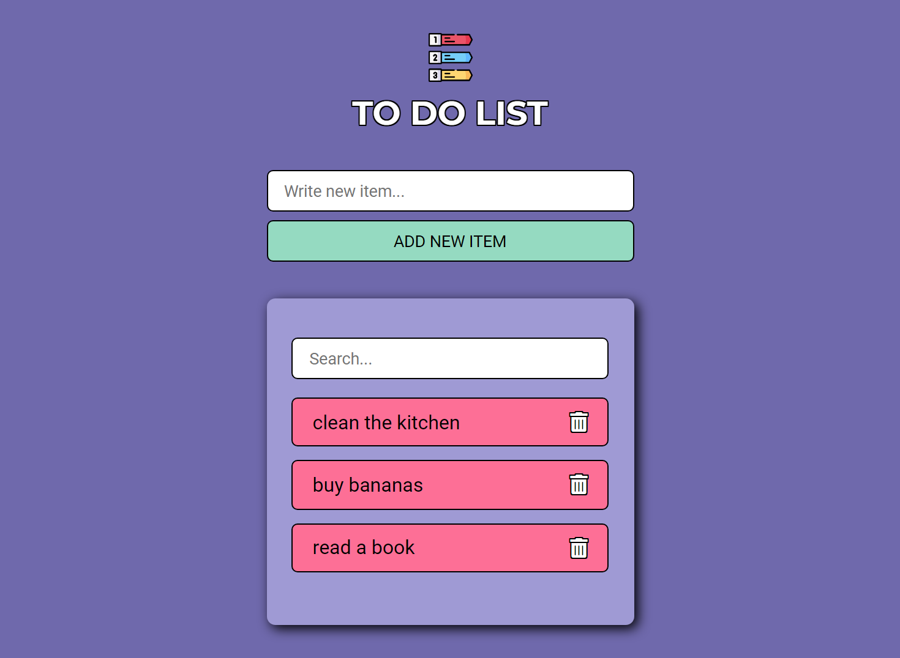

# To Do List
Una lista simple para añadir y eliminar cosas por hacer, así como buscar entre las ya disponibles. Puedes probarlo a través de este [link](https://nurimartinez.github.io/todolist/).

  

Descripción
-------------
* Página web con diseño responsive.
* Estructura semántica del HTML.

Características
-------------
* HTML5
* CSS3
* JS
* SASS

